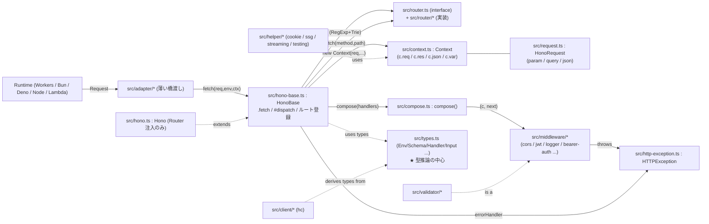

# Phase 2: アーキテクチャマップ

## アーキテクチャスタイルの命名

Hono の構造は **「Web Standards 上に乗ったレイヤード + プラガブル」** が一番近い。

- レイヤード: 入口 (Adapter / `.fetch`) → ルーティング (Router) → ミドルウェア合成 (compose) → アプリケーション (Handler) → 応答生成 (Context)
- プラガブル: Router・ミドルウェア・JSX レンダラ・バリデータ・クライアント生成器 がすべて入れ替え可能/オプショナル。
- 「依存方向は外→内 (Adapter は core を import するが、core は Adapter を一切知らない)」というクリーンな単方向。

## コンポーネント図 (Mermaid)

## 主要コンポーネント (各 1 行)

| コンポーネント | パス | 役割 (1 行) |
|---|---|---|
| **Hono (facade)** | `src/hono.ts` | ユーザーが `new Hono()` する公開クラス。`HonoBase` を継承し `SmartRouter(RegExp+Trie)` を注入する。 |
| **HonoBase (core)** | `src/hono-base.ts` | ルート登録 (`.get/.post/.use/.route/.mount`) と実行 (`.fetch` → `#dispatch`) の本体。 |
| **Router (interface)** | `src/router.ts` | `add(method, path, handler)` と `match(method, path): Result<T>` の最小契約。 |
| **Router 実装群** | `src/router/{reg-exp,trie,linear,pattern,smart}-router/` | パターン照合戦略。`SmartRouter` は登録ルートを試して最良を選ぶ。 |
| **compose** | `src/compose.ts` | Koa 風ミドルウェア合成。`next()` で深く潜り、戻る順で後処理が走る。`onError`/`onNotFound` フック付き。 |
| **Context** | `src/context.ts` | リクエスト全体の状態と応答生成器。`c.req` / `c.res` / `c.json()` / `c.text()` / `c.var` / `c.set/get`。 |
| **HonoRequest** | `src/request.ts` | 標準 `Request` のラッパ。`param()` / `query()` / `json()` / `parseBody()` を提供。 |
| **types.ts** | `src/types.ts` | `Env`, `Schema`, `Handler`, `HandlerInterface`, `Input`, `ToSchema` などの型システム中枢。 |
| **HTTPException** | `src/http-exception.ts` | 認証失敗等で投げる Error。`getResponse()` で Response を返す。 |
| **Adapter** | `src/adapter/<runtime>/` | 各ランタイム → `app.fetch(req,env,ctx)` を呼ぶ最小ブリッジ。 |
| **Middleware** | `src/middleware/<name>/` | 既製ミドルウェア。`MiddlewareHandler` 型に従い、`compose` で接続される。 |
| **Validator** | `src/validator/validator.ts` | バリデーション結果を `c.req.valid('json')` 等で型付きに取り出すミドルウェアファクトリ。 |
| **Client** | `src/client/*` | `hc<typeof app>()` で `app` から型を導出して fetch ラッパを生成。 |

> コンポーネント数は約 12 個。原則 7±2 を少しはみ出るが、Hono の「コア + 周辺プラグイン」を語るには必須要素のみ。

## 依存方向 (確認)

- `hono-base.ts` の import: `./compose`, `./context`, `./router`, `./types`, `./utils/*` のみ。Adapter/Middleware を知らない (→ 単方向)。
- `hono.ts` は `hono-base` と `router/*` を import。
- `middleware/<x>/index.ts` は `../../context`, `../../http-exception`, `../../types` を import。下層は上層を import しない。
- `adapter/<x>/*` は `../../hono` を import するが、その逆はない。

## 外部依存

- **ランタイム標準**: `Request`, `Response`, `Headers`, `URL`, `URLPattern`, `crypto.subtle`, `TextEncoder`。サードパーティ依存ゼロが Hono の売り。
- **`package.json` の `dependencies`**: 実は空に近い (依存薄)。`devDependencies` のみ豊富 (vitest, tsx, esbuild, eslint, prettier, etc.)。
- **ピア環境**: TypeScript ≥ 5。ランタイムは「Web Fetch API を持つもの」全般。
