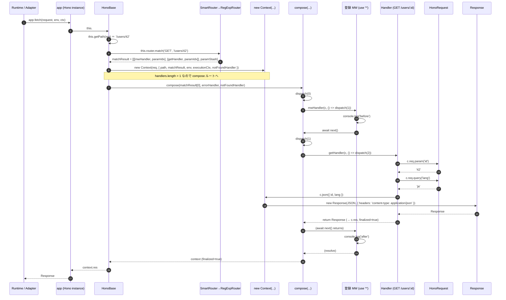

# Phase 4: 代表フロー — 「あるルートへの HTTP リクエストがハンドラに到達して応答が返るまで」

## 選んだフロー

具体例として、以下のアプリで `GET /users/42?lang=ja` が来た場合を追う。

```ts
import { Hono } from 'hono'

const app = new Hono()

app.use('*', async (c, next) => {       // ① ロガー的なミドルウェア
  console.log('before')
  await next()
  console.log('after')
})

app.get('/users/:id', (c) => {          // ② ハンドラ
  const id = c.req.param('id')
  const lang = c.req.query('lang')
  return c.json({ id, lang })
})

export default app                       // ランタイム側が app.fetch(req) を呼ぶ
```

この `GET /users/42?lang=ja` の旅を 1 本のシーケンスで描く。

## シーケンス図



## 各矢印の対応 (ファイルパス:行 + 関数名)

ベースパスは `/tmp/eval-1/hono` (= `src/...`)。

1. **`RT → App: app.fetch(...)`**
   - `src/hono-base.ts:473-479` — `Hono.fetch` プロパティ。`(request, ...rest) => this.#dispatch(request, rest[1], rest[0], request.method)`
   - アダプタ例: `src/adapter/cloudflare-workers/handler.ts`, `src/adapter/bun/serve.ts`, Node では `@hono/node-server` (別パッケージ) が `app.fetch` を呼ぶ。

2. **`App → Base: #dispatch(...)`**
   - `src/hono-base.ts:400-460` — `#dispatch(request, executionCtx, env, method)`
   - `method === 'HEAD'` の場合は GET として処理し body を捨てる分岐あり (`:407-410`)。

3. **`this.getPath(req)`**
   - `src/hono-base.ts:412` — `const path = this.getPath(request, { env })`
   - 既定: `src/utils/url.ts:106 getPath` (strict) / `:141 getPathNoStrict`
   - `?` や `#` を切って `/users/42` を返す。`%` を含むときだけ decode。

4. **`Router.match('GET', '/users/42')`**
   - `src/hono-base.ts:413` — `const matchResult = this.router.match(method, path)`
   - 起点 `Hono` の Router は `src/hono.ts:30-32` で `new SmartRouter({ routers: [new RegExpRouter(), new TrieRouter()] })`
   - `src/router/smart-router/router.ts:21-61` — 初回 `match` で全ルートを各 Router に投入し、`UnsupportedPathError` を投げない最初の Router にバインドして以後 `this.match = router.match.bind(router)` で直結。
   - 典型的には `RegExpRouter` が勝つ (`src/router/reg-exp-router/router.ts` の `match`)。
   - 戻り値型: `Result<[H, RouterRoute]>` = `[handlers[], paramStash]` (RegExp 形式) or `[handlers[]]` (Trie 形式)。`src/router.ts:98`

5. **`new Context(req, {...})`**
   - `src/hono-base.ts:415-421`
   - コンストラクタは `src/context.ts:352-361`
   - この時点では `c.req` (HonoRequest) は遅延生成 (`src/context.ts:366-369` の getter)。

6. **handlers が 1 本だけならショートカット, 2 本以上は compose**
   - `src/hono-base.ts:424-442` — `matchResult[0].length === 1` の高速パス (Phase 4 例ではミドルウェア + ハンドラの 2 本なので使われない)
   - `src/hono-base.ts:444` — `const composed = compose(matchResult[0], this.errorHandler, this.#notFoundHandler)`

7. **`compose(...)` → `dispatch(0)`**
   - `src/compose.ts:15-73` — `compose<E>` ファクトリ
   - 内部 `dispatch(i)` 関数 (`:32-71`):
     - `middleware[i]` から `[H, paramMap]` のうち `[0]` (= handler) を取り出す
     - `context.req.routeIndex = i` を更新 (HonoRequest.param が現在の matchResult 行を参照するのに使う) → `src/compose.ts:44`, `src/request.ts:107`
     - `await handler(context, () => dispatch(i + 1))` を呼ぶ (`:51`)
     - 例外を捕まえて `onError(err, context)` に流す (`:52-60`)

8. **`mwHandler(c, next)` (① ミドルウェア)**
   - ユーザー定義。`console.log('before')` → `await next()` → `console.log('after')`
   - `compose` の `dispatch(1)` がここで呼ばれる。

9. **`getHandler(c, next)` (② ハンドラ)**
   - ユーザー定義。`c.req.param('id')`, `c.req.query('lang')`, `return c.json(...)`

10. **`c.req.param('id')`**
    - `src/context.ts:366-369` で `HonoRequest` を遅延 `new`
    - `src/request.ts:94-104` `param(key?)`
    - `src/request.ts:106-110` `#getDecodedParam` → `#matchResult[0][routeIndex][1][key]` でパラメータインデックスを取り、`#getParamValue` (`:126-128`) で `paramStash` から実値 (`'42'`) を取得。

11. **`c.req.query('lang')`**
    - `src/request.ts:148-152` → `getQueryParam(this.url, 'lang')` (`src/utils/url.ts`)。`'ja'` を返す。

12. **`c.json({ id, lang })`**
    - `src/context.ts:708-721` — `JSON.stringify(object)` → `#newResponse(body, arg, contentType=application/json)`
    - `#newResponse` (`src/context.ts:604-639`) で `Headers` を組み立て、`createResponseInstance(data, { status, headers })` で `Response` を生成。
    - 返り値が `Response` として呼び出し元 (`compose`) に返る → `dispatch(i)` の `res` 変数。
    - `compose.ts:67-69`: `if (res && (context.finalized === false || isError)) context.res = res` で `c.res` に代入 → `Context.res` setter (`src/context.ts:414-434`) が `finalized = true` をセット。

13. **`await next()` から復帰 → MW 後処理**
    - mwHandler 内の `console.log('after')` が動く。
    - mwHandler が `Promise<void>` を返すと `compose.ts:67-69` の条件 `res` が undefined のためここでは `c.res` を上書きしない。`finalized` は既に true。

14. **`compose` が完了 → Base が context を取得**
    - `src/hono-base.ts:448` — `const context = await composed(c)`
    - `:449-453` — `if (!context.finalized) throw new Error('Context is not finalized. ...')`
    - `:455` — `return context.res`

15. **`app.fetch` の戻り値が Runtime に返る**
    - 各 Adapter は受け取った `Response` をランタイムの応答に変換。例えば Cloudflare Workers なら `export default { fetch }` 形式でそのまま返す。Bun では `Bun.serve({ fetch })` がそのまま処理。

## エラーパス (1 本)

ハンドラ内で `throw new HTTPException(401, { message: 'unauthorized' })` を投げた場合:

- `compose.ts:50-60` で `try/catch`。`err instanceof Error && onError` が真なので `await onError(err, context)` を呼ぶ。
- 既定の `errorHandler` (`src/hono-base.ts:35-42`):
  - `err` が `getResponse` を持つ (= `HTTPException`) なら `err.getResponse()` を `c.newResponse` でラップして返す。
  - そうでなければ `console.error(err)` + `c.text('Internal Server Error', 500)`。
- `context.res = res` がセットされ、`finalized = true` → `dispatch` が戻り、`compose` が `context` を返す。
- `#dispatch` の `try/catch` (`src/hono-base.ts:447-458`) は `compose` 全体が再度 throw した時の最終防衛網。

## 「コードを開かずに矢印を辿れるか」自己テスト

> 「Runtime が `app.fetch(req)` を呼ぶ → HonoBase の `#dispatch` がパスを切り出して Router.match → 結果から Context を作って compose に渡す → compose の dispatch(0) が再帰的に next を渡しながら各ミドルウェア/ハンドラを呼ぶ → 最後のハンドラが `c.json` などで Response を作って `c.res` に入れる → ミドルウェアが await next の続きを実行 → compose が完了して context.res を返す → fetch が Response を返す。」 — これが言えれば Phase 4 終了。
