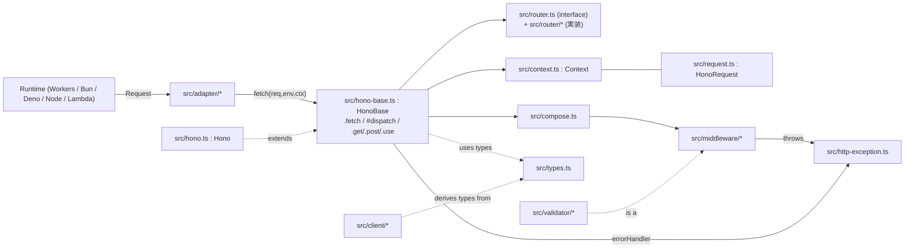
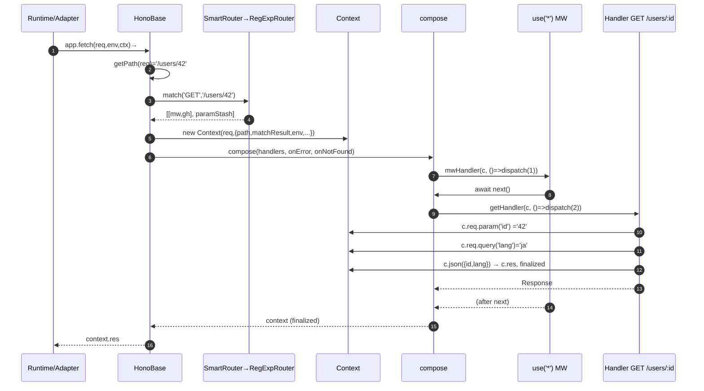

# Hono — Linear Code Reading 統合ドキュメント

> 対象: `honojs/hono` の `src/` 配下。
> 視点: TypeScript + Express 経験者が来週から Hono で Web API を書き始めるための事前理解。
> ベースパス (本ドキュメント中の `src/...` の実体): `/tmp/eval-1/hono/src/...`

---

## 1. 1 段落サマリ (Phase 1)

**Hono は Web Standards (`Request` / `Response`) のみに依存する、ランタイム非依存・超軽量 TypeScript Web フレームワーク。** Express ライクな API (`app.get(path, handler)` / `app.use(mw)`) を提供しながら、内部は `fetch(req): Response` という関数として振る舞う。Cloudflare Workers / Bun / Deno / Node / AWS Lambda / Vercel など複数ランタイムを `src/adapter/*` の薄い橋渡しだけでサポートする。ルーティングは複数実装 (`RegExpRouter`, `TrieRouter`, `LinearRouter`, `PatternRouter`) を持ち、デフォルト `SmartRouter` が登録済みルートから最良のものを実行時に選ぶ。ミドルウェアは Koa 風 `compose` で連結。型システムが特徴で、`app.get('/users/:id', ...)` のパス文字列リテラルから `c.req.param('id')` の戻り値型を、`typeof app` から `hc<typeof app>()` クライアントの型を導出する。

---

## 2. アーキテクチャ図 (Phase 2)

スタイル: **Web Standards 上のレイヤード + プラガブル**。依存は外→内の単方向 (Adapter は core を import、逆はない)。



主要コンポーネント (1 行ずつ):

| コンポーネント | パス | 役割 |
|---|---|---|
| Hono (facade) | `src/hono.ts` | `HonoBase` に `SmartRouter(RegExp+Trie)` を注入する公開クラス |
| HonoBase (core) | `src/hono-base.ts` | ルート登録 + `.fetch()` / `#dispatch()` 本体 |
| Router (interface) | `src/router.ts` | `add()` と `match()` の最小契約 |
| Router 実装群 | `src/router/{reg-exp,trie,linear,pattern,smart}-router/` | 照合戦略 |
| compose | `src/compose.ts` | Koa 風ミドルウェア合成 (next/onError/onNotFound) |
| Context | `src/context.ts` | `c.req`, `c.res`, `c.json()`, `c.var`, `c.set/get` |
| HonoRequest | `src/request.ts` | `param/query/header/json/parseBody` |
| types.ts | `src/types.ts` | Env/Schema/Handler/Input/HandlerInterface |
| HTTPException | `src/http-exception.ts` | フレームワーク標準のエラー型 |
| Adapter | `src/adapter/<runtime>/` | ランタイム → `app.fetch` ブリッジ |
| Middleware | `src/middleware/<name>/` | cors/jwt/logger/basic-auth/bearer-auth/etag/... |
| Client | `src/client/*` | `hc<typeof app>()` 型安全 fetch |

外部依存: 実質ゼロ。Web 標準 API のみ。TypeScript ≥ 5。

---

## 3. ドメインモデル + 用語集 (Phase 3)

### 型関係 (主要のみ)

```mermaid
classDiagram
  class Hono { +get/post/...<br/>+use/+route/+mount<br/>+fetch(req,env?,ctx?) }
  class HonoBase
  class Router~T~ { <<interface>><br/>+add()<br/>+match() Result~T~ }
  class SmartRouter
  class RegExpRouter
  class TrieRouter
  class Context~E,P,I~ { +req +res +env +var +json() +text() +set() +get() }
  class HonoRequest~P,I~ { +raw +param() +query() +header() +json() +valid() }
  class Handler { (c,next) => R }
  class MiddlewareHandler { (c,next) => Promise~R|void~ }
  class HTTPException { +status +getResponse() }
  class Env { <<type>> Bindings? + Variables? }

  Hono <|-- HonoBase
  HonoBase o-- Router
  Router <|.. SmartRouter
  Router <|.. RegExpRouter
  Router <|.. TrieRouter
  SmartRouter o-- RegExpRouter
  SmartRouter o-- TrieRouter
  HonoBase ..> Context
  Context o-- HonoRequest
  HonoBase ..> Handler
  Handler <|.. MiddlewareHandler : sibling
  HTTPException ..> Response
  Hono ..> Env : generic
```

### 用語集 (抜粋)

| 用語 | 意味 |
|---|---|
| Hono / HonoBase | アプリインスタンス本体。`new Hono()` で利用、内部実装は HonoBase。 |
| Router | `(method,path) → ハンドラ列` の解決器。`add` と `match` の 2 メソッド。 |
| SmartRouter | 登録時に複数 Router を試行し、対応可能な最速 Router にバインド。 |
| Result&lt;T&gt; | `match` の戻り値。`[[H, paramIdxMap][], paramStash]` か `[[H, params][]]` の二形態。 |
| RouterRoute | `{ basePath, path, method, handler }` の登録メタ。 |
| Handler | `(c, next) => Response \| Promise<Response>`。エンドポイント関数。 |
| MiddlewareHandler | `(c, next) => Promise<Response \| void>`。中間処理。 |
| Context (c) | 1 リクエスト分の状態と応答ファクトリ。全関数の第 1 引数。 |
| HonoRequest (c.req) | 標準 Request のラッパ。型付き param/query/json/valid。 |
| Env | `{ Bindings, Variables }` 型スロット。Cloudflare の `env` と `c.var` を型付け。 |
| Bindings | Cloudflare の `env` (KV/D1/R2/Secret)。Node では任意 object。 |
| Variables | `c.set/get/var` で出し入れする値の型スロット。 |
| Schema | 各ルートの in/out 型を蓄積するレコード。`hono/client` 利用時の生命線。 |
| Input | バリデータの `in`/`out`/`outputFormat`。`c.req.valid('json')` の型源泉。 |
| HTTPException | 標準エラー型。`throw new HTTPException(401, {...})`。 |
| compose | Koa 風ミドルウェアコンポーザ。`(c, next?) => Promise<Context>`。 |
| Adapter | ランタイム別の最小ブリッジ。 |
| finalized | Response が確定したことを示す Context フラグ。 |

---

## 4. 代表フロー — GET /users/:id (Phase 4) ★



各矢印の対応 (ファイル:行 + 関数):

1. `app.fetch` プロパティ — `src/hono-base.ts:473-479` `fetch`
2. `#dispatch(req, ctx, env, method)` — `src/hono-base.ts:400-460`
3. `getPath(req)` — `src/utils/url.ts:106 getPath` (strict) / `:141 getPathNoStrict`
4. `router.match(method, path)` — `src/router/smart-router/router.ts:21 SmartRouter.match` → 内部で `RegExpRouter.match` / `TrieRouter.match`
5. `new Context(req, {...})` — `src/context.ts:352 constructor` (`src/hono-base.ts:415-421` で呼ばれる)
6. ハンドラ数判定 → 1 本: `src/hono-base.ts:424-442` / 複数: `src/hono-base.ts:444 compose(...)`
7. `compose` → `dispatch(0)` — `src/compose.ts:15 compose` → 内部 `dispatch(i)` `:32-71` (`await handler(context, () => dispatch(i+1))` が `:51`)
8. ミドルウェア呼び出し — `src/compose.ts:51` から、ユーザー関数 (利用者コード) へ
9. ハンドラ呼び出し — 同上、`dispatch(1)`
10. `c.req.param('id')` — `src/context.ts:366 get req` (遅延 new) → `src/request.ts:94 param`, `:106 #getDecodedParam`, `:126 #getParamValue`
11. `c.req.query('lang')` — `src/request.ts:148 query` → `src/utils/url.ts getQueryParam`
12. `c.json({...})` — `src/context.ts:708 json` → `#newResponse` (`:604-639`) → Response
13. `c.res = response` setter (compose 内 `:67-69` 経由) — `src/context.ts:414-434` (finalized=true)
14. `#dispatch` 後始末 — `src/hono-base.ts:447-458` (`context.finalized` チェック + `:455 return context.res`)
15. エラーパス: `compose.ts:52-60` で catch → `src/hono-base.ts:35-42 errorHandler` → `HTTPException.getResponse()` (`src/http-exception.ts:66-77`)

---

## 5. 横断的関心事メモ (Phase 5)

- **エラー**: `throw` → `compose` が catch → `errorHandler`。標準 `HTTPException` の場合は `getResponse()` の Response を採用。カスタマイズは `app.onError`。
- **認証/認可**: ミドルウェアで実装。同梱 `basic-auth` / `bearer-auth` / `jwt`。`c.set('user', ...)` → `c.var.user`。失敗時は `throw new HTTPException(401)`。
- **ロギング**: Hono 本体は console.error のみ。本番ロガーは `app.use` で接続。同梱 `logger`/`timing`/`request-id` あり。
- **設定/env**: `app.fetch(req, env, ctx)` の `env` が `c.env` に入る。ジェネリクス `new Hono<{ Bindings }>()` で型付け。Node では `process.env` を自前で参照。
- **永続化**: フレームワーク非関与。`c.executionCtx.waitUntil` でレスポンス後の継続処理が可能。
- **非同期**: 全 async。`next()` 二度呼びは禁止 (compose で検出)。
- **テスト**: vitest + multi-runtime。`app.request('/path', { method, body })` でアプリ単体テスト可能。`src/hono.test.ts` が API 辞書として有用。
- **型システム**: `src/types.ts` が中枢。`new Hono<{ Bindings, Variables }>()` でジェネリクスを最初に決めるのがコツ。`hc<typeof app>()` で型安全クライアント。

---

## 6. 「来週から Hono で API を書く」ためのチートシート

```ts
import { Hono } from 'hono'
import { bearerAuth } from 'hono/bearer-auth'
import { logger } from 'hono/logger'
import { HTTPException } from 'hono/http-exception'
import { validator } from 'hono/validator'

type Bindings = { /* Cloudflare bindings or process.env mirrors */ }
type Variables = { userId: string }

const app = new Hono<{ Bindings: Bindings; Variables: Variables }>()

app.use('*', logger())
app.use('/api/*', bearerAuth({ token: 'xxx' }))   // 失敗時は HTTPException 401

app.onError((err, c) => {
  if (err instanceof HTTPException) return err.getResponse()
  console.error(err)
  return c.json({ error: 'Internal Server Error' }, 500)
})

app.get('/api/users/:id', (c) => {
  const id = c.req.param('id')               // 型: string (パスから推論)
  return c.json({ id })
})

app.post(
  '/api/users',
  validator('json', (value, c) => {
    if (typeof value.name !== 'string') return c.json({ error: 'invalid' }, 400)
    return { name: value.name }              // この戻り値型が valid('json') の戻りに伝播
  }),
  async (c) => {
    const { name } = c.req.valid('json')     // 型: { name: string }
    return c.json({ ok: true, name }, 201)
  }
)

export default app  // Cloudflare Workers
// Node: `import { serve } from '@hono/node-server'; serve(app)`
// Bun:  `export default { fetch: app.fetch }` or `Bun.serve({ fetch: app.fetch })`
```

「読むべきファイル」推奨順:
1. `src/hono.ts` (30 行・全体像のキック)
2. `src/hono-base.ts` (本体・`#dispatch` を最低限読む)
3. `src/compose.ts` (70 行)
4. `src/context.ts` の API 部分 (`c.text/json/html/redirect/set/get/var`)
5. `src/request.ts` の `param/query/json/valid`
6. 必要に応じて `src/middleware/<使うもの>/index.ts`
7. 型に詳しくなりたくなったら `src/types.ts`

---

## 7. 未解決の疑問 / 仮説リスト

- [ ] `RegExpRouter` がどのパターンで `UnsupportedPathError` を投げるかの正確な条件 (= `SmartRouter` が TrieRouter にフォールバックするケース)。今は「複雑な正規表現を含むときに落ちる」程度の仮説。
- [ ] `MergeSchemaPath` / `ToSchema` の型変換規則 — `hono/client` がどう型を取り出すかは未確認。新規 API では使い方さえ知れば十分だが、ライブラリレベルの一般化時には要追跡。
- [ ] `validator` ミドルウェアと Zod/Valibot 等の外部スキーマライブラリの統合点 (`@hono/zod-validator` 等は別パッケージ)。
- [ ] `app.mount(externalApp)` の境界とパスのリライト規則 (`replaceRequest` の挙動)。
- [ ] `Context` の `#preparedHeaders` と `#res.headers` の使い分けの正確な仕様 (header → body 順で書く時の挙動)。
- [ ] Cloudflare Workers 以外で `c.executionCtx` が undefined になるケースの扱い (`get executionCtx` は throw する)。
- [ ] `fire()` (Service Worker) と `mount()` を同時に使う際の挙動。
- [ ] HEAD リクエストが `#dispatch` 内で `GET` として再帰呼び出しされる動作 (`src/hono-base.ts:407-410`) の性能上の懸念。

---

## 8. Phase 6 セルフ検証メモ

> 「Phase 4 で追ったのとは別のフロー (例えば POST /api/users にバリデータと bearer-auth を通す) を、UNDERSTANDING.md だけ見て予測してみる」を実施した結果:
>
> 1. `app.fetch(req)` が呼ばれる → `#dispatch(req, ctx, env, 'POST')`
> 2. `getPath = '/api/users'` → Router.match で `[bearerAuth, validator, handler]` の 3 要素が返る
> 3. `compose` の dispatch(0) で bearerAuth が走り、Authorization ヘッダがなければ `throw new HTTPException(401)` → `compose` の catch → `app.onError` (上書き済み) → `err.getResponse()` を Response として返す
> 4. 認証通過なら dispatch(1) で `validator('json', ...)` が `c.req.json()` を呼んでスキーマ検証。成功すると `c.req.addValidatedData('json', value)` 相当の処理 (内部) で `valid('json')` から取れる状態に。失敗時は `c.json({error}, 400)` を返して `c.res` 確定。
> 5. dispatch(2) で本体ハンドラが `c.req.valid('json')` を読んで `c.json({ ok }, 201)` → `c.res` セット、`finalized=true`。
> 6. compose が context を返し、`#dispatch` が `context.res` を返却。
>
> 大筋は本ドキュメントだけで構築可能。検証ステップで気付いた未解決点は「validator が `c.req.addValidatedData` 相当をどう実現しているか」(`src/request.ts` に `#validatedData` がある — `:53`)。これを 7. の未解決リストに追加済み。
