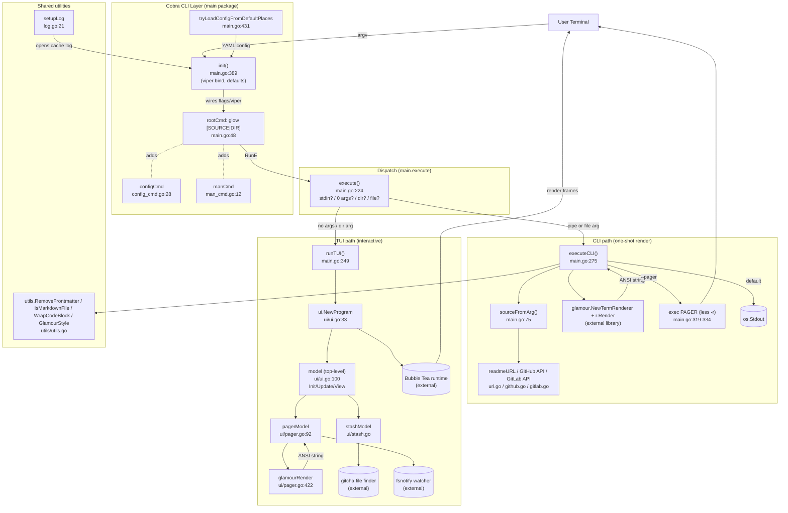

# Phase 2: アーキテクチャマップ

## アーキテクチャスタイルの命名

**「Cobra ベースの薄い CLI + Bubble Tea (Elm Architecture) の TUI レイヤ + glamour への描画委譲」**。
レイヤード/ヘキサゴナルといった大仰な分類は不要で、実態は **2 つの実行モード (CLI / TUI) を `execute()` が振り分け、共通の描画責務だけが `glamour` ライブラリに収まる** という形。

## コンポーネント図

## コンポーネントの責務 (1 行ずつ)

| Component | パス | 責務 |
|---|---|---|
| `rootCmd` | `main.go:48` | Cobra のルートコマンド宣言 (フラグ・短い説明・`RunE: execute`) |
| `init()` | `main.go:389` | フラグ宣言 + viper bind + デフォルト + サブコマンド `AddCommand` |
| `tryLoadConfigFromDefaultPlaces` | `main.go:431` | XDG/GLOW_CONFIG_HOME から `glow.yml` を Viper にロード |
| `execute()` | `main.go:224` | stdin / 0 args / dir arg / file arg を見て CLI モードと TUI モードを振り分ける **唯一のディスパッチャ** |
| `sourceFromArg` | `main.go:75` | 引数文字列 → `*source` (io.Reader + URL) に解決。ファイル / HTTP / GitHub URL / dir 内 README を網羅 |
| `executeCLI` | `main.go:275` | ソースを読み切って frontmatter 除去 → glamour で描画 → stdout か pager に流す。**CLI モードの全責務がここに集約** |
| `runTUI` | `main.go:349` | `env.ParseAs[ui.Config]` で環境変数を読み、`ui.NewProgram(cfg, content).Run()` で Bubble Tea を起動 |
| `ui.NewProgram` | `ui/ui.go:33` | `tea.NewProgram(model, opts...)` を返す。マウスや AltScreen のオプションをここで決める |
| `ui.model` | `ui/ui.go:100` | トップレベル model。`stash` と `pager` を持ち、`state` で切り替える。Bubble Tea の `Init/Update/View` を実装 |
| `pagerModel` | `ui/pager.go:92` | 1 つの Markdown を viewport で表示。`renderWithGlamour` → `contentRenderedMsg` で内容更新 |
| `stashModel` | `ui/stash.go` | gitcha が見つけたファイルを一覧。スピナ、ページネータ、フィルタ |
| `glamour` (external) | - | Markdown → ANSI 変換の本体。glow からは `NewTermRenderer / Render` だけ叩く |

## 依存方向

- `main` パッケージ → `ui` パッケージ (一方向)。`ui` は `main` を import しない。
- `main` パッケージ → `utils` パッケージ。`ui` も `utils` を import (`RemoveFrontmatter`, `IsMarkdownFile`, `GlamourStyle`)。
- 設定は **環境変数 → viper → CLI フラグ → `ui.Config` 構造体** の順で流れる:
  - Viper は `init()` で flag を bind し、`validateOptions()` (`main.go:167`) で `viper.GetX()` してパッケージ変数に格納。
  - `runTUI` ではさらに `env.ParseAs[ui.Config]()` で `GLAMOUR_STYLE`/`GLOW_HIGH_PERFORMANCE_PAGER`/`GLOW_ENABLE_GLAMOUR` 等を上書き。

## 外部依存 (副作用ポイント)

| 依存先 | 用途 | 触れるファイル |
|---|---|---|
| ファイルシステム | Markdown 読み出し, config 読書, ログ書き込み | `main.go:111,142`, `log.go:32`, `ui/ui.go:193` |
| stdin | パイプ入力 | `main.go:230` |
| stdout | CLI モードの最終出力先 | `main.go:342` |
| HTTP (api.github.com / gitlab.com / 任意 URL) | リモート README 取得 | `main.go:95`, `github.go:28`, `gitlab.go` |
| 外部プロセス (PAGER) | `--pager` フラグ時のページャ起動 | `main.go:319-334` |
| ターミナル (TTY) | サイズ取得 / TTY 判定 / 背景色判定 | `main.go:187-208`, `ui/ui.go:137` (`termenv.HasDarkBackground`) |
| clipboard | TUI で `c` を押した時 | `ui/pager.go:232-234` |
| エディタ ($EDITOR) | `glow config` と TUI の `e` キー | `config_cmd.go:40`, `ui/editor.go` |
| fsnotify | TUI で開いているファイルの再読込 | `ui/pager.go:17,255,503` |

## 終了条件チェック

「あるリクエストが入ったらどのコンポーネントを通るか」を矢印で辿れる → **OK**。
具体的には `argv → init() → rootCmd.Execute → execute() → executeCLI → sourceFromArg → glamour.Render → stdout` のパスを上の図でなぞれる。
