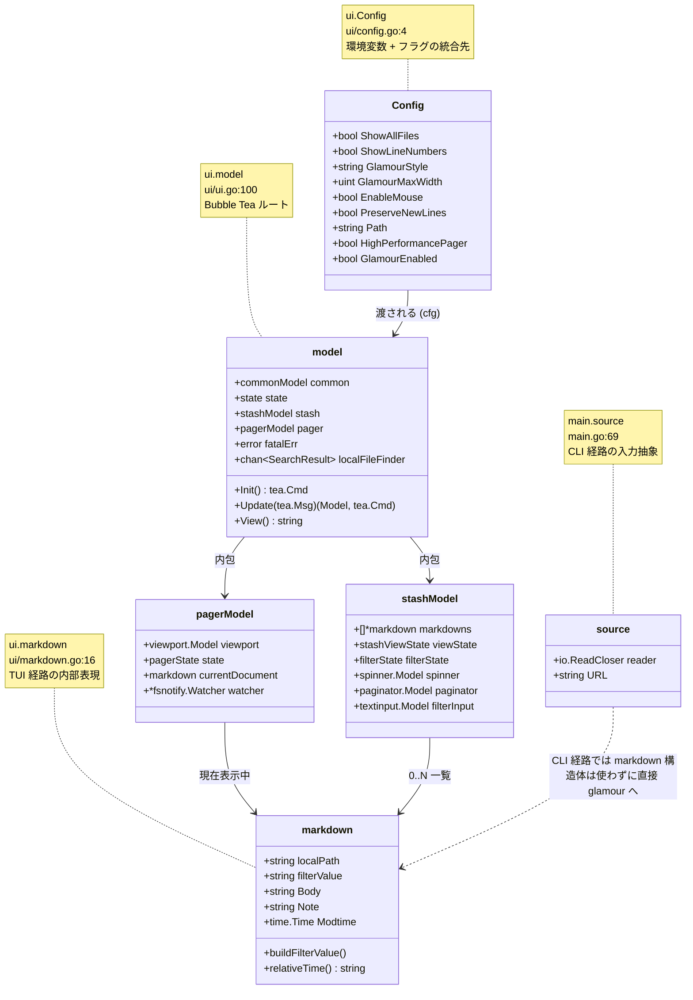
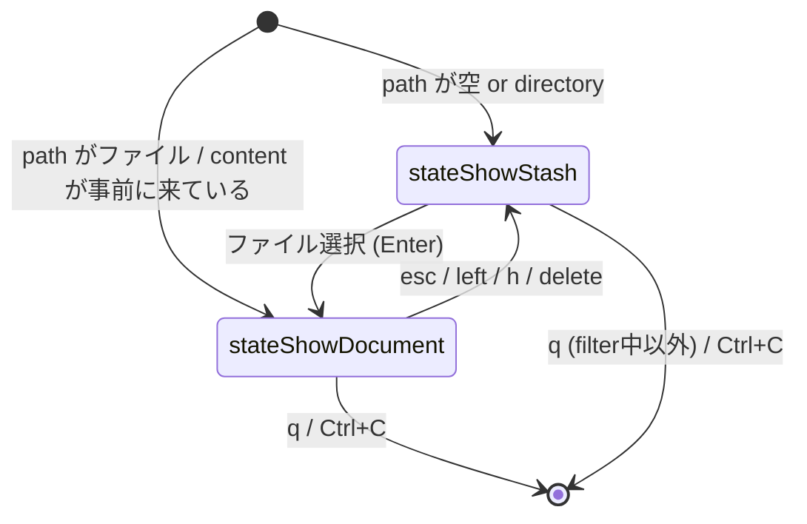

# Phase 3: ドメインモデル

> CLI ツールなのでドメインモデルは薄い。SKILL.md のアダプテーション表に従い軽め (5〜10 個に絞る)。

## 中心エンティティ

## 状態 (enum) と遷移

### `ui.state` (`ui/ui.go:80`)

### `ui.pagerState` (`ui/pager.go:87`)

- `pagerStateBrowse`: 通常表示
- `pagerStateStatusMessage`: 一時メッセージ ("Copied contents" など) を 3 秒間表示中

### `ui.stashViewState` (`ui/stash.go:63`)

- `stashStateReady`: 一覧通常表示
- `stashStateLoadingDocument`: 選択したファイルを読み込み中
- `stashStateShowingError`

### `ui.filterState` (`ui/stash.go:91`)

- `unfiltered` / `filtering` (入力中) / `filterApplied` (フィルタ確定)

## 用語集

| 用語 | 意味 |
|---|---|
| **Cobra** | spf13 の Go 製 CLI フレームワーク。コマンドツリーとフラグを宣言的に書く。`PersistentPreRunE` で前処理 |
| **Viper** | spf13 の設定ライブラリ。YAML/JSON/env/フラグを統合。`BindPFlag` で Cobra フラグと結ぶ |
| **Bubble Tea** | Charm の TUI フレームワーク。Elm Architecture: `Init() Cmd` → イベントループで `Update(Msg) (Model, Cmd)` → `View() string` |
| **Bubbles** | Bubble Tea 上の再利用可能ウィジェット集 (viewport, spinner, paginator, textinput) |
| **Lipgloss** | ANSI スタイルを宣言的に書くための DSL ライブラリ |
| **Glamour** | Markdown を ANSI 着色テキストに変換する Charm のレンダラ。`NewTermRenderer(opts...).Render(md)` が公開 API |
| **Stash** | 元はクラウド保管機能の名残。今は単に **「ローカル/開いているドキュメントの一覧画面」** を指す内部名 |
| **Pager** (内部の `pagerModel`) | TUI 内の **1 ドキュメント表示画面** (`less` 風) |
| **PAGER** (CLI フラグ `--pager`) | 外部プロセスとしての `less -r` 等。混同注意 |
| **Frontmatter** | Markdown 冒頭の `---\n...\n---` ブロック (YAML メタ)。glow は描画前に削ぎ落とす (`utils.RemoveFrontmatter`) |
| **AltScreen** | 端末の代替画面バッファ。TUI 終了時に元画面が復帰する仕組み。`tea.WithAltScreen()` で有効化 |
| **HighPerformancePager** | viewport の高速描画モード。`GLOW_HIGH_PERFORMANCE_PAGER` 環境変数で切替。デフォルト `true` |
| **gitcha** | muesli 製のローカルファイル探索器。`.gitignore` を尊重しながらマッチするファイルをチャネルに流す |
| **notty スタイル** | stdout が TTY でないときに自動選択される、ANSI 装飾なしの glamour スタイル (`main.go:191`) |

## ドメイン理解の口頭テスト

> **Q: `markdown` と `source` の関係を 3 文で。**
>
> `source` は CLI 経路で「これから読む Markdown の入口」を抽象化したもので、`io.ReadCloser` + URL を持つ。CLI モードでは `source` から直接バイト列を読んで glamour に渡すだけなので、`markdown` 構造体は **登場しない**。`markdown` は TUI 側 (`ui` パッケージ) の内部表現で、一覧表示やフィルタ・最終更新時刻表示に使われる。両者は意図的に切り離されている。

## 終了条件チェック

主要エンティティ (`source` / `markdown` / `Config` / `model`) と状態を口頭で説明できる → **OK**。
