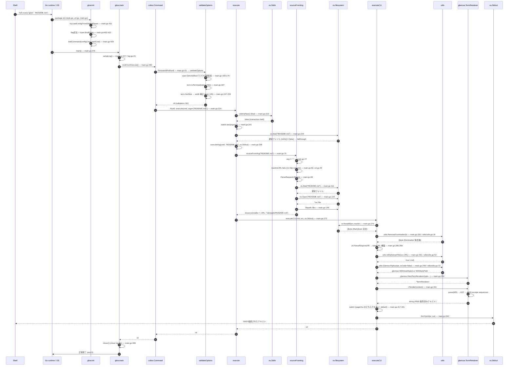

# Phase 4: 代表フローのトレース ★最重要

## 選んだフロー

**`$ glow README.md`** を打鍵してから、ターミナル (stdout) にレンダリングされた Markdown が表示されるまで。

- 前提: stdin はパイプではない (普通の対話的シェルから実行)
- 前提: `README.md` はカレントディレクトリに存在する Markdown ファイル
- 前提: `--pager` も `--tui` も指定なし → デフォルトの「stdout に書き出すだけ」パス

CLI ツールの最も基本的かつ最も短い実行経路なので、ここを完全に追えば他 (パイプ / URL / TUI モード) も差分理解で済む。

## シーケンス図

## 各矢印のファイルパス + 関数名 (図と 1 対 1 対応)

| # | 矢印 | ファイル:行 | 関数/シンボル |
|---|---|---|---|
| 1 | Shell → OS: fork+exec | (OS) | `execve("glow", ...)` |
| 2 | OS → Init: パッケージ初期化 | `/tmp/eval-2/glow/main.go:389` | `func init()` |
| 3 | init → tryLoadConfig | `/tmp/eval-2/glow/main.go:431` | `tryLoadConfigFromDefaultPlaces` |
| 4 | init → フラグ宣言+viper bind | `/tmp/eval-2/glow/main.go:402-422` | `rootCmd.PersistentFlags / Flags / viper.BindPFlag` |
| 5 | init → AddCommand | `/tmp/eval-2/glow/main.go:428` | `rootCmd.AddCommand(configCmd, manCmd)` |
| 6 | OS → Main | `/tmp/eval-2/glow/main.go:376` | `func main` |
| 7 | main → setupLog | `/tmp/eval-2/glow/log.go:21` | `setupLog` |
| 8 | main → rootCmd.Execute | `/tmp/eval-2/glow/main.go:382` | `rootCmd.Execute()` |
| 9 | Cobra → PersistentPreRunE | `/tmp/eval-2/glow/main.go:61-63` | クロージャ → `validateOptions` |
| 10 | validateOptions: viper.GetX | `/tmp/eval-2/glow/main.go:169-175` | `viper.GetUint`, `viper.GetBool` |
| 11 | validateOptions: term.IsTerminal | `/tmp/eval-2/glow/main.go:187` | `term.IsTerminal(int(os.Stdout.Fd()))` |
| 12 | validateOptions: term.GetSize | `/tmp/eval-2/glow/main.go:197` | `term.GetSize` |
| 13 | Cobra → execute | `/tmp/eval-2/glow/main.go:64,224` | `RunE: execute` |
| 14 | execute → stdinIsPipe | `/tmp/eval-2/glow/main.go:213` | `stdinIsPipe` |
| 15 | execute switch len(args)==1 | `/tmp/eval-2/glow/main.go:241-251` | `case 1: ...` |
| 16 | execute: os.Stat | `/tmp/eval-2/glow/main.go:244` | `os.Stat(args[0])` (ディレクトリでなければ fallthrough) |
| 17 | execute → executeArg | `/tmp/eval-2/glow/main.go:256` | `executeArg(cmd, arg, os.Stdout)` |
| 18 | executeArg → sourceFromArg | `/tmp/eval-2/glow/main.go:267` | `sourceFromArg(arg)` |
| 19 | sourceFromArg: HTTP URL 判定 | `/tmp/eval-2/glow/main.go:89` | `url.ParseRequestURI(arg)` (false) |
| 20 | sourceFromArg: os.Stat → ディレクトリでない | `/tmp/eval-2/glow/main.go:111-141` | (skip directory branch) |
| 21 | sourceFromArg: os.Open | `/tmp/eval-2/glow/main.go:142` | `os.Open(arg)` |
| 22 | sourceFromArg: filepath.Abs | `/tmp/eval-2/glow/main.go:146` | `filepath.Abs(arg)` |
| 23 | sourceFromArg → 戻り値 | `/tmp/eval-2/glow/main.go:150` | `return &source{r, u}, nil` |
| 24 | executeArg → executeCLI | `/tmp/eval-2/glow/main.go:272` | `executeCLI(cmd, src, w)` |
| 25 | executeCLI: io.ReadAll | `/tmp/eval-2/glow/main.go:276` | `io.ReadAll(src.reader)` |
| 26 | executeCLI: RemoveFrontmatter | `/tmp/eval-2/glow/utils/utils.go:18` | `utils.RemoveFrontmatter` |
| 27 | executeCLI: baseURL 構築 | `/tmp/eval-2/glow/main.go:285-289` | `url.ParseRequestURI(src.URL)` |
| 28 | executeCLI: IsMarkdownFile | `/tmp/eval-2/glow/utils/utils.go:53` | `utils.IsMarkdownFile(src.URL)` (true) |
| 29 | executeCLI: GlamourStyle | `/tmp/eval-2/glow/utils/utils.go:73` | `utils.GlamourStyle(style, false)` |
| 30 | executeCLI: NewTermRenderer | `/tmp/eval-2/glow/main.go:294` | `glamour.NewTermRenderer(...)` |
| 31 | executeCLI: r.Render | `/tmp/eval-2/glow/main.go:311` | `r.Render(content)` |
| 32 | executeCLI: switch default | `/tmp/eval-2/glow/main.go:341` | `default:` (pager / tui 不選択) |
| 33 | executeCLI: fmt.Fprint(w, out) | `/tmp/eval-2/glow/main.go:342` | `fmt.Fprint(os.Stdout, out)` |
| 34 | main: closer() | `/tmp/eval-2/glow/main.go:386` | ログファイル close |

## 副作用の総まとめ

| 種別 | 発生箇所 |
|---|---|
| ファイル読み込み | `os.Open("README.md")` (`main.go:142`), `io.ReadAll` (`main.go:276`) |
| ファイル書き込み | ログファイル (`log.go:32-37`, デフォルト `~/Library/Caches/glow/glow.log`) |
| 設定ファイル読み込み | `viper.ReadInConfig` (`main.go:456`) — 無くてもエラーにしないだけ |
| 環境変数読み込み | `os.Getenv("PAGER")` (`main.go:319`), `XDG_CONFIG_HOME` / `GLOW_CONFIG_HOME` (`main.go:439-445`), `viper.SetEnvPrefix("glow"); viper.AutomaticEnv()` (`main.go:453`) |
| 標準出力書き込み | `fmt.Fprint(w, out)` (`main.go:342`) |
| 標準入力読み取り | `os.Stdin.Stat()` (`main.go:214`)。ただし今回のパスでは「パイプではない」と判定して即抜け |
| 端末状態の問い合わせ | `term.IsTerminal` / `term.GetSize` (`main.go:187,197`), `lipgloss.ColorProfile()` (`main.go:295`) |
| ネットワーク | 今回のパスでは **発生しない** (arg がローカルファイルなので URL 判定が偽) |
| 外部プロセス起動 | 今回のパスでは **発生しない** (`--pager` 未指定) |

## エラーパス (主要な 1 本)

**「`glow nonexistent.md`」を実行した場合** (引数のファイルが存在しない場合):

1. `execute` → `os.Stat("nonexistent.md")` (`main.go:244`) で **err != nil** → `IsDir()` 偽
2. fallthrough して `executeArg(cmd, arg, os.Stdout)` (`main.go:256`)
3. `sourceFromArg("nonexistent.md")` の中で:
   - URL 判定すべて false
   - `os.Stat(arg)` (`main.go:111`) で **err 発生** → ディレクトリ分岐に入らない
   - `os.Open(arg)` (`main.go:142`) で **err 発生**
   - `return nil, fmt.Errorf("unable to open file: %w", err)` (`main.go:144`)
4. `executeArg` がそのエラーを return
5. `execute` がそのエラーを return
6. `cobra` がエラーを `os.Stderr` に表示し、`rootCmd.Execute()` は err を返す
7. `main()` で `os.Exit(1)` (`main.go:384`)

エラーは Cobra の `SilenceErrors: false` (main.go:54) によって Cobra 標準のフォーマットで出力される。
Glamour レンダリングまで到達した場合のエラー (`main.go:312`) も同じ経路で stderr に出る。

## Bubble Tea 補足 (初見向け)

CLI 経路では Bubble Tea は **一切走らない**。`--tui` を付けるか引数 0 個か引数がディレクトリのときだけ `runTUI` (`main.go:349`) → `ui.NewProgram` (`ui/ui.go:33`) を経由して Bubble Tea のメインループが回る。

Bubble Tea の基本 (`ui/ui.go:186-338` を読むと一目瞭然):

1. **`Init() tea.Cmd`** (`ui/ui.go:186`): 起動直後に 1 回だけ呼ばれる。返した `tea.Cmd` (= `func() tea.Msg`) を Bubble Tea ランタイムが非同期実行 → `tea.Msg` を Update に流す。
2. **`Update(msg tea.Msg) (tea.Model, tea.Cmd)`** (`ui/ui.go:205`): 来たメッセージ (キー入力 / 自前の `fetchedMarkdownMsg` / `tea.WindowSizeMsg` 等) で状態を遷移させて新しい model と新しい Cmd を返す純粋関数的 API。
3. **`View() string`** (`ui/ui.go:327`): 現在の state を文字列に描画。Bubble Tea が diff して端末に書く。

TUI モードでは描画は `m.pager.View()` → 内部で `m.viewport.View()` → 中身は `renderWithGlamour` (`ui/pager.go:410`) が返した文字列。
**つまり CLI モードでも TUI モードでも、最終的に Markdown を ANSI 文字列にしているのは同じ `glamour.NewTermRenderer(...).Render(...)` の呼び出し** で、glow 本体は周辺の I/O だけが違う。

## 終了条件チェック

- 各矢印に対してファイル:行 + 関数名を 1 表で並べた → **OK**
- ユーザーがコードを開かずに「`README.md` → ANSI までの 7 個程度の関数」を列挙できる:
  - `init` (`main.go:389`) → `main` (`main.go:376`) → `rootCmd.Execute` → `validateOptions` (`main.go:167`) → `execute` (`main.go:224`) → `sourceFromArg` (`main.go:75`) → `executeCLI` (`main.go:275`) → `glamour.Render` → `fmt.Fprint(os.Stdout)`
  → **OK**
