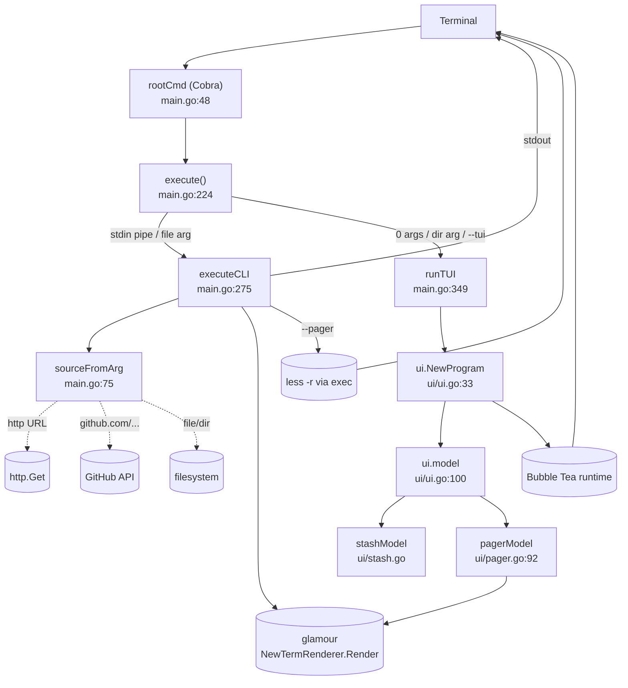
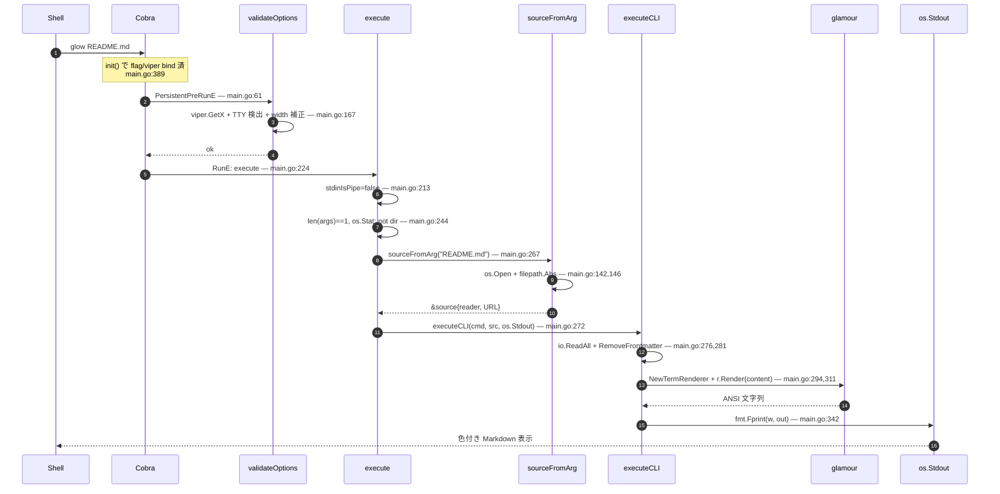

# UNDERSTANDING.md — glow (charmbracelet/glow)

> Phase 0〜5 の成果物を 1 つに圧縮した「最終理解ドキュメント」。
> このドキュメントを手元に置けば、glow に最小限の変更を加えるタスク (新フラグ追加・新ソース入力 etc.) を始められる、を到達点とする。

---

## 1. 1 段落サマリ

`glow` は、引数なしで起動すると **TUI モード**に入り手元の Markdown を一覧表示・閲覧でき、引数 (ファイル / URL / GitHub・GitLab レポ / stdin の `-`) を渡すと **CLI モード**で 1 回だけ整形して標準出力に書き出す、二面性のあるツールである。中核の Markdown→ANSI 変換は **glamour** ライブラリに完全に委譲し、glow 本体の責務は (1) ソース解決 (2) ターミナル環境検出 (3) 出力先選択 (stdout / pager / TUI) に絞られている。TUI は Bubble Tea (Elm Architecture: `Init / Update / View`) で組まれ、トップレベル `model` の下に `stash` (ファイル一覧) と `pager` (1 ドキュメント表示) の 2 サブモデルが状態 enum で切り替わる。

---

## 2. アーキテクチャ図



主要コンポーネント (7 個):

1. **Cobra root + init** — フラグ宣言、viper bind、サブコマンド (`config`, `man`)
2. **`execute()`** — 唯一のディスパッチャ。pipe / argc / dir でモードを決める
3. **`sourceFromArg`** — 引数文字列 → `*source` (`io.Reader` + URL)
4. **`executeCLI`** — CLI モード本体: 読み → frontmatter 除去 → glamour で描画 → stdout/pager
5. **`runTUI` + `ui.NewProgram`** — Bubble Tea 起動
6. **`ui.model`** — TUI のルート (stash と pager を抱える)
7. **`glamour`** (外部) — 実際の Markdown→ANSI 変換

---

## 3. ドメインモデルと用語集

### コア型 (4 個)

| 型 | 場所 | 役割 |
|---|---|---|
| `source` | `main.go:69` | CLI 経路の入力抽象 (`io.ReadCloser` + URL) |
| `markdown` | `ui/markdown.go:16` | TUI 内部表現 (localPath / Body / Note / Modtime) |
| `Config` | `ui/config.go:4` | TUI 設定 (env タグ付き構造体) |
| `model` (top) | `ui/ui.go:100` | Bubble Tea ルート model |

### 状態遷移 (`ui.state`)

```
[start] --path is file--> stateShowDocument
[start] --path is dir / 空--> stateShowStash
stateShowStash --Enter--> stateShowDocument
stateShowDocument --esc/h/left--> stateShowStash
*  --q/Ctrl+C--> [exit]
```

### 用語集 (抜粋)

- **Cobra**: CLI フレームワーク (コマンドツリー + フラグ)
- **Viper**: 設定統合 (YAML + env + フラグ)
- **Bubble Tea**: TUI フレームワーク (Elm Architecture: `Init() Cmd` / `Update(Msg) (Model, Cmd)` / `View() string`)
- **Glamour**: Markdown→ANSI 変換ライブラリ (`NewTermRenderer(opts...).Render(md)`)
- **Lipgloss**: ANSI スタイル DSL
- **Stash**: TUI のファイル一覧画面 (歴史的な内部名)
- **Pager** (内部): TUI の 1 ドキュメント画面 / `--pager` (CLI フラグ): 外部 `less` 等 — **混同注意**
- **Frontmatter**: Markdown 冒頭の `---` ブロック。glow は描画前に削ぐ
- **AltScreen**: TUI 終了時に元画面が復帰する端末バッファ
- **notty スタイル**: stdout が TTY でないときに自動採用される色なしスタイル

---

## 4. 代表フロー: `glow README.md` → ターミナル描画



7 関数で言える短縮版:

> `init()` → `main()` → `rootCmd.Execute()` → `validateOptions()` → `execute()` → `sourceFromArg()` → `executeCLI()` → (`glamour.Render()`) → `fmt.Fprint(os.Stdout, out)`

(ファイル:行) は Phase 4 ドキュメントの 34 行の表を参照。

---

## 5. 横断的関心事 (要点だけ)

- **エラー**: `fmt.Errorf("...: %w", err)` で wrap して上に伝播。Cobra が stderr に整形。TUI 内では `errMsg` を `tea.Msg` として流す。
- **設定**: env → YAML → flag を viper で統合 (`main.go:413-426`)。`ui.Config` は `caarlos0/env` で別途 env から読む。
- **ログ**: `charmbracelet/log` を **ファイルに DebugLevel で**。失敗しても本体は動く設計 (`log.go`)。
- **並行性**: CLI は完全同期。TUI は Bubble Tea ランタイムが `tea.Cmd = func() tea.Msg` を goroutine で実行 → `Update` に Msg を配送する非同期パターン。
- **TTY 検出**: `term.IsTerminal(os.Stdout.Fd())` で非 TTY を検出し style=`notty` に切替 (`main.go:187-191`)。これによりパイプで壊れない。

---

## 6. 検証 — 別フロー予測 (Phase 6 self-test)

Phase 4 で追ったのと **別のフロー**「`echo '# Hi' | glow -`」を、コードを開かずに予測してから確認する。

### 予測 (記憶ベース)

1. パッケージ init → main → `rootCmd.Execute` → `validateOptions` まで同じ
2. `execute()` 冒頭の `stdinIsPipe()` が **true** を返す (`os.Stdin.Stat().Mode()&os.ModeCharDevice == 0`)
3. `src := &source{reader: os.Stdin}` を作って即 `executeCLI(cmd, src, os.Stdout)` に渡す
4. `executeCLI` は `io.ReadAll(os.Stdin)` で全文吸って、あとは普通の `glamour.Render` → stdout

### コード照合

- `main.go:227-233`:
  ```go
  if yes, err := stdinIsPipe(); err != nil {
      return err
  } else if yes {
      src := &source{reader: os.Stdin}
      defer src.reader.Close()
      return executeCLI(cmd, src, os.Stdout)
  }
  ```
- 予測一致。`-` リテラル引数の場合は `sourceFromArg("-")` 内 `main.go:77-79` で同じ `{reader: os.Stdin}` を返すので結果同じ。
- 注意点: パイプ経由の場合 `src.URL == ""` なので `executeCLI` 内の `url.ParseRequestURI("")` は失敗 → `baseURL = ""` で `glamour` に渡る。これは Phase 4 図には書かなかった微差。

→ **ズレなし。理解は実用上正しい。**

---

## 7. 未解決の疑問 / 仮説リスト

1. **Glamour 内部**: AST 構築・スタイル適用の詳細は今回読まなかった (glow 側からは API レベル)。`glow -s mystyle.json` のスタイル JSON フォーマットを変更したくなったら別途 glamour を読む必要がある。
2. **HighPerformancePager** (`GLOW_HIGH_PERFORMANCE_PAGER`) が `viewport` に何を変えるのか未調査。`ui/pager.go:112` で渡しているだけしか見ていない。
3. **stash の filter ロジック**: fuzzy 検索 + diacritics 除去 (`ui/markdown.go:49 normalize`) が動いているのは分かるが、ヒット順位の計算詳細は読んでいない。
4. **GitHub URL 解決の挙動**: トップレベル `username/repo` 形式のみ対応 (`url.go:64`)。サブパス指定 (`github.com/foo/bar/blob/main/docs/X.md`) は今のコードだと未対応に見えるが、ユースケースとして許容しているかは未確認。
5. **Windows ANSI** (`console_windows.go`) の有効化タイミング: build tag で main の前に init で動く想定だが詳細は未読。
6. **`-` リテラル引数 + パイプなし** で起動したらどうなる? → 予想: `os.Stdin` が TTY のまま、`io.ReadAll(os.Stdin)` で **ブロック**する。エラーにする方が親切な可能性。
7. **TUI モードでの `fsnotify` のクロスプラットフォーム挙動**: macOS / Linux / Windows で再描画タイミングが揃うか不明。

---

## 8. これ以降できること

- 新フラグを追加: `main.go:402-426` 周辺で `Flags().BoolVarP` + `viper.BindPFlag` + `validateOptions` で読む、を真似ればよい。
- 新ソースタイプを追加 (例: S3 URL): `sourceFromArg` (`main.go:75`) のスイッチに分岐を追加すればよい。`source` インターフェースは `io.ReadCloser` + URL だけなので拡張しやすい。
- TUI に画面を追加: `ui/ui.go:100` の `model` に新フィールドと新 state 値を増やし、`Init/Update/View` の各分岐に新画面用ケースを足す。
