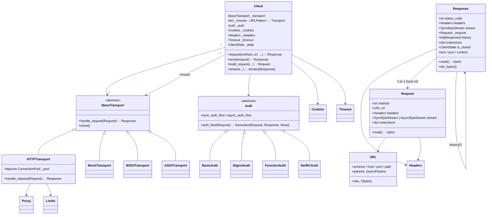
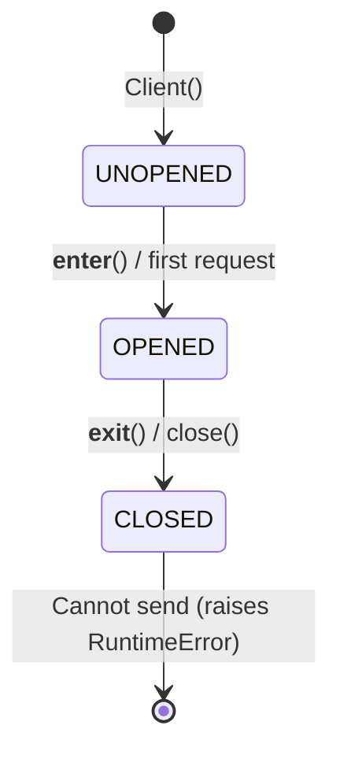

# Phase 3: ドメインモデル

ライブラリなので「ドメイン」は **HTTP のリクエスト/レスポンスとセッション** が中心。
DDD 的なエンティティの代わりに、ライブラリの **公開型 + 内部の核となる型** をまとめる。

## 主要エンティティ (ER 風)

## 状態遷移: `ClientState`

(`httpx/_client.py:125-136`)

## 状態遷移: `Response` のストリーム

- `is_closed: bool` — ストリーム解放済みか
- `is_stream_consumed: bool` — ボディを全消費済みか
- `_content: bytes` — 一括取得後にキャッシュされる (`read()` の結果)
- 例外 `ResponseNotRead` — `_content` が未取得で `.content` / `.text` / `.json` を呼んだ場合

## 用語集 (HTTPX 固有 / 区別が必要なもの)

| 用語 | 意味 |
|---|---|
| **Transport** | `BaseTransport` を実装したオブジェクト。`handle_request(Request) -> Response` を持つ「I/O 境界」 |
| **httpcore** | HTTPX が依存する低水準 HTTP ライブラリ。**HTTPX のトランスポート** はこれを内包しているだけで、`httpcore` 自体は別パッケージ |
| **ConnectionPool** | `httpcore` 側の概念。実際にソケットを保持して keep-alive を行う |
| **Mount** | `Client(mounts={"https://example.com": HTTPTransport()})` のように **URL パターン別にトランスポートを切り替える** 仕組み (`URLPattern` がマッチング担当) |
| **Auth flow** | 認証を **ジェネレータ** で表現する HTTPX 独自パターン。`yield request` → 戻ってきた `response` を受けて次の request を `yield`、で終わったら `return`。Digest auth の challenge-response が代表例 |
| **Event hooks** | `request` / `response` フックを `Client(event_hooks={...})` で登録。デバッグ・ロギング用途 |
| **USE_CLIENT_DEFAULT** | `Client.request(..., timeout=USE_CLIENT_DEFAULT)` のように「省略時はクライアントレベル設定を使う」ことを明示的に表す sentinel (`UseClientDefault` のシングルトン) |
| **extensions** | `Request.extensions` / `Response.extensions` は dict。`timeout`, `http_version`, `reason_phrase`, `sni_hostname` 等を **httpcore と相互運用するためのバッグ** |
| **trust_env** | `True` で環境変数 (`HTTP_PROXY` 等) や netrc を尊重 |
| **Stream (SyncByteStream / AsyncByteStream)** | 「バイト列を yield する反復可能オブジェクト」のプロトコル (`_types.py`)。リクエスト/レスポンスのボディはこれを通じて遅延読み出し |
| **BoundSyncStream** | レスポンス受信後に `response.elapsed` をセットするため `httpcore` の生ストリームをラップしたもの (`_client.py:139`) |
| **redirect history** | `Response.history` はリダイレクトを辿った場合の中間レスポンスリスト |
| **DEFAULT_TIMEOUT_CONFIG** | `Timeout(timeout=5.0)` (`_config.py:246`)。connect/read/write/pool すべて 5 秒 |
| **DEFAULT_LIMITS** | `Limits(max_connections=100, max_keepalive_connections=20)` (`_config.py:247`) |
| **URLPattern** | `mounts` のキー (`"all://"`, `"https://*example.com"` 等) をマッチする内部ユーティリティ |

## 中核エンティティの関係 (3 行で説明)

> `Client` は **セッション状態 (headers/cookies/auth/timeouts)** と **トランスポート (の集合)** を抱える。
> 各 `request()` 呼び出しは `Request` を組み立て、`auth_flow` でラップしたうえで、
> URL に応じた `BaseTransport.handle_request()` に渡し、戻ってきた `Response` を返す。
> `Request` と `Response` は双方向参照 (`response._request`) で結ばれ、リダイレクト時の
> 中間 `Response` は `Response.history` に積まれる。

## DB スキーマは?

ライブラリなので **永続化なし**。Cookies のみ実行時メモリ (`Cookies` クラス) に保持。
これがフェーズ 3 を短くできる理由でもある。

## 終了条件

「`Client` と `Request` と `Response` と `BaseTransport` の関係を口頭で説明してください」
に対し、上記 3 行サマリで答えられる。
